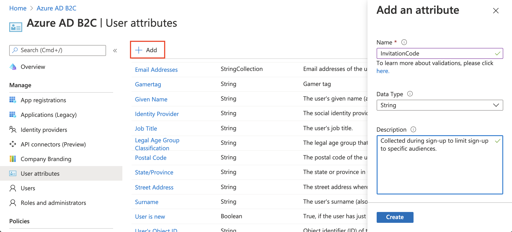
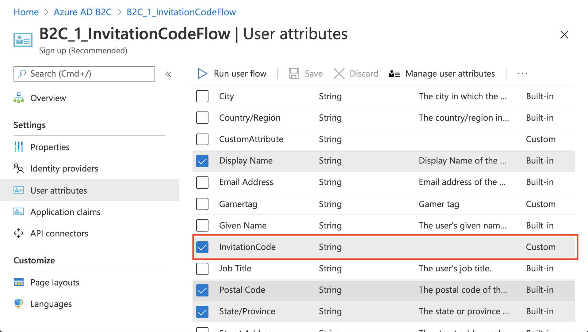
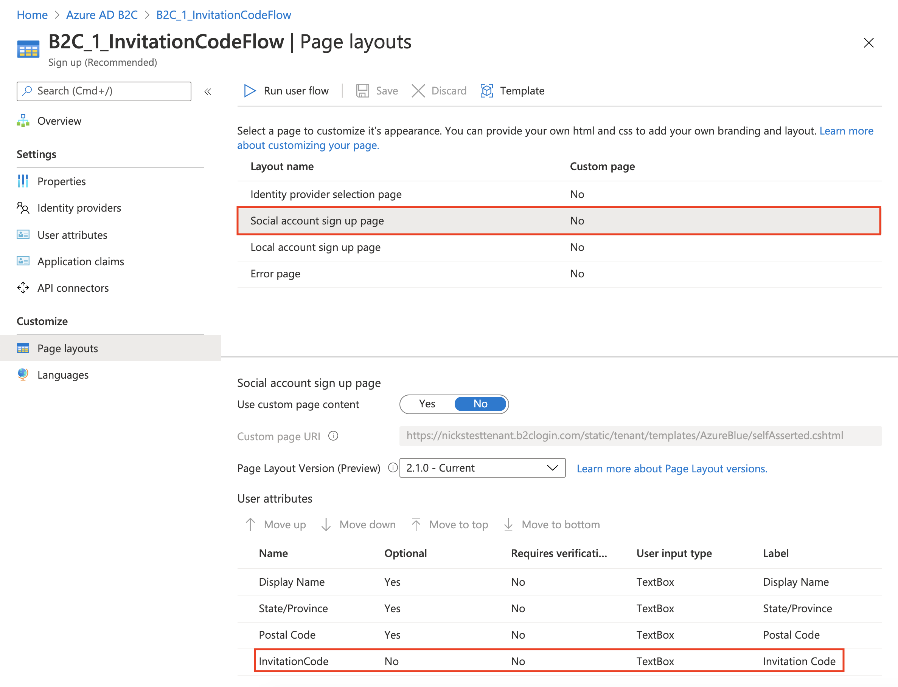
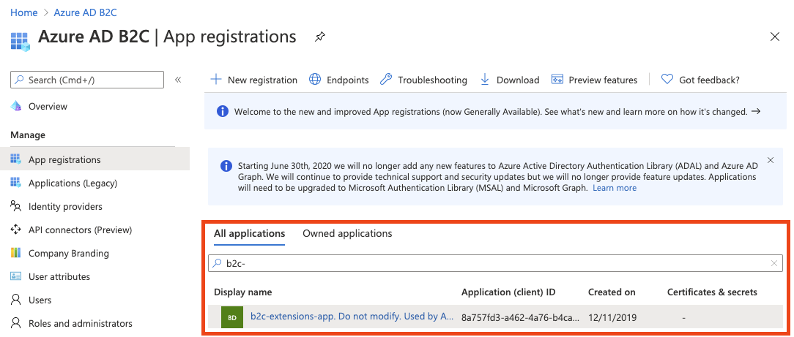
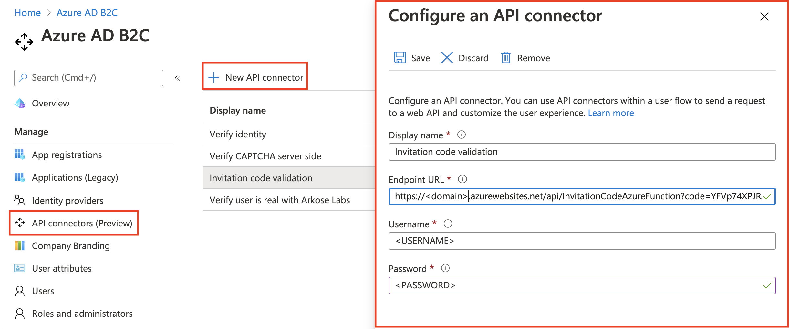
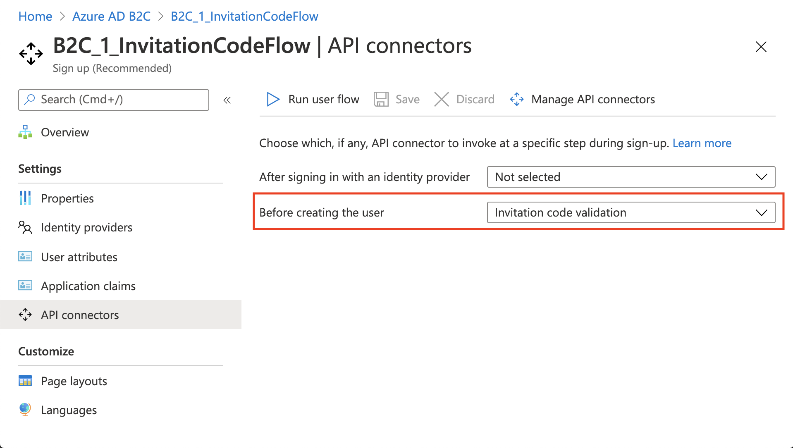

# active-directory-node-b2c-user-flow-invitation-code

## Contents

| File/folder                 | Description                                |
| --------------------------- | ------------------------------------------ |
| `InvitationCodeAzureFunction` | Sample source code for Node.js HTTP trigger.    |
| `README.md`                 | This README file.                          |
| `.gitignore`                | Define what to ignore at commit time.      |
| `CONTRIBUTION.md`                   | Guidance on how to contribute to this repository.        |
| `LICENSE.md`                   | The license for the sample.                |
| `SECURITY.md`                   | The security notice for the sample.                |

## Key Concepts

Often times, you may want to limit sign-ups to your application and tenant to specific audiences. An "audience" may be a singular person (with a corresponding email address), a set of people, or more using invitation codes. An invitation code is collected from a user during sign-up and validated. A user may get this invitation code from an email you send them or some other method. The exact logic is open ended and can accommodate a variety of scenarios.

Key components:

- [**Azure Functions HTTP trigger**](https://docs.microsoft.com/azure/azure-functions/functions-bindings-http-webhook-trigger?tabs=javascript) - API endpoint hosted by you that receives an invitation code and user information and checks whether it's valid.
- **Azure AD B2C sign-up user flow** - The sign-up experience that will be limited by an invitation code. Will utilize [API connectors](https://docs.microsoft.com/azure/active-directory-b2c/api-connectors-overview) to integrate with the Azure Function HTTP trigger.

This sample provides a starting point for an invitation code sign-up flow.

## Create a "InvitationCode" Custom Attribute

1. From the Azure Portal, go to **Azure AD B2C**
1. Select **User Attributes**
1. Select **Add**
1. Enter `InvitationCode` as the attribute **Name**
1. **Create**



Learn more about [custom attributes](https://docs.microsoft.com/azure/active-directory-b2c/user-flow-custom-attributes).

## Create a user flow

This can be either be a **sign up and sign in** or a just **sign up** or user flow.

1. [Follow these instructions](https://docs.microsoft.com/azure/active-directory-b2c/tutorial-create-user-flows).
    1. If using an existing user flow, note that user flows must be of the "Recommended (next-generation preview)" version type.
1. In the user flow settings, navigate to **User attributes** and select the **InvitationCode** claim.



## Configure page layouts

1. From the Azure Portal, go to **Azure AD B2C**
1. Navigate to **User flows** and select your user flow
1. Select **Page layouts**
1. Select **Local account sign up page** layout
1. Select the **Optional** value to **No**.
1. Use drag and drop to place the invitation code in the order that you'd like to appear when in the user sign-up form.
1. Set the **Label** to **"Invitation Code"**



## Create and deploy your API

These steps assume you use Visual Studio Code, but deploying the Azure Function via the Azure Portal, terminal or command prompt, or any other code editor will also work.

**Prerequisite**: Install the [Azure Functions extension](https://marketplace.visualstudio.com/items?itemName=ms-azuretools.vscode-azurefunctions) for Visual Studio Code.

### Run the API locally

1. Navigate to the **Azure extension** in Visual Studio code on the left navigation bar. You should see a 'Local Project' folder representing your local Azure Function.
1. Press **F5** (or use the **Debug > Start Debugging** menu command) to launch the debugger and attach to the Azure Functions host. (This command automatically uses the single debug configuration that Azure Functions created.)
1. The Azure Function extension will automatically generate a few files for local development, install dependencies, and install the Function Core tools if not already present. These tools help with the debugging experience.
1. Output from the Functions Core tools appears in the VS Code **Terminal** panel. Once the host has started, **Alt+click** the local URL shown in the output to open the browser and run the function. You can also see the url of the locally-hosted function by right clicking on the function on the Azure Functions explorer.
1. To redeploy the local instance during testing, just repeat these steps.

### Add environment variables

This sample protects the web API endpoint using [HTTP Basic authentication](https://tools.ietf.org/html/rfc7617).

Here, username and password are stored as environment variables so they're not stored as part of the repository. Read more about the [local.settings.json](https://docs.microsoft.com/azure/azure-functions/functions-run-local?tabs=macos%2Ccsharp%2Cbash#local-settings-file) file.

1. Create a **local.settings.json** file in your root folder
1. Copy and paste the below code onto the file:

```json
{
  "IsEncrypted": false,
  "Values": {
    "AzureWebJobsStorage": "",
    "FUNCTIONS_WORKER_RUNTIME": "node",
    "BASIC_AUTH_USERNAME": "<USERNAME>",
    "BASIC_AUTH_PASSWORD": "<PASSWORD>",
    "B2C_EXTENSIONS_APP_ID": "<B2C_EXTENSIONS_APP_ID>"
  }
}
```

The **BASIC_AUTH_USERNAME** and **BASIC_AUTH_PASSWORD** are going to be the credentials used to authenticate the API call to your Azure Function. Choose your desired values.

The `<B2C_EXTENSIONS_APP_ID>` is the application ID of the app used by Azure AD B2C to store custom attributes in the directory. You can find this application ID by navigating to **App registrations**, searching for `b2c-extensions-app` and copying the `Application (client) ID` from the **Overview** pane. Remove the `-` characters.



### Deploy the application to the web

1. Follow steps of [this](https://docs.microsoft.com/azure/javascript/tutorial-vscode-serverless-node-04) guide #1-7 to deploy your Azure Function to the cloud. Copy the endpoint web URL of your Azure Function.
1. Once deployed, you'll see an **'Upload settings'** option. Select this. It will upload your environment variables onto the [Application settings](https://docs.microsoft.com/azure/azure-functions/functions-develop-vs-code?tabs=csharp#application-settings-in-azure) of the App service. These application settings can also be configured or [managed via the Azure portal](https://docs.microsoft.com/azure/azure-functions/functions-how-to-use-azure-function-app-settings).

To learn more about Visual Studio Code development for Azure Functions, see [this](https://docs.microsoft.com/azure/azure-functions/functions-develop-vs-code?tabs=csharp#republish-project-files).

## Configure and enable the API connector

Follow the steps outlined in ["Add an API connector"](https://docs.microsoft.com/azure/active-directory-b2c/add-api-connector) to create an API connector and enable it your user flow. The configuration should look like the below.

### API connector configuration

Your API connector configuration should look like the following:



- **Endpoint URL** is the Function URL you copied earlier if the deployed Azure Function.
- **Username** and **Password** are the Username and Passwords you defined as environment variables earlier.

### Enable the API connector

In the **API connector** settings for your user flow, select the API connector to be invoked at the **Before creating the user** step. This will invoke the API when a user hits 'Create' in the sign-up flow. The API will do a server-side validation of the invitation code to determine whether to allow the user to sign up.

